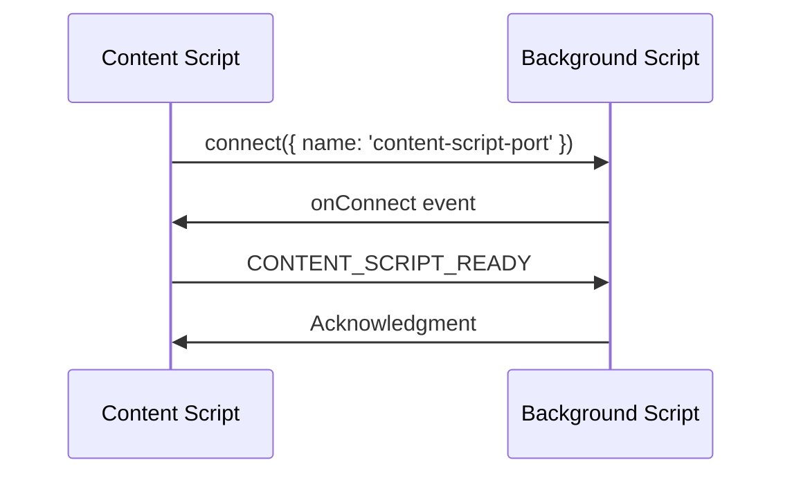
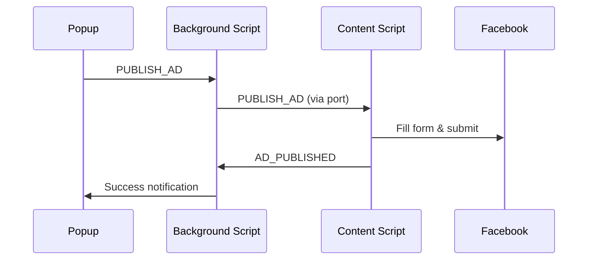
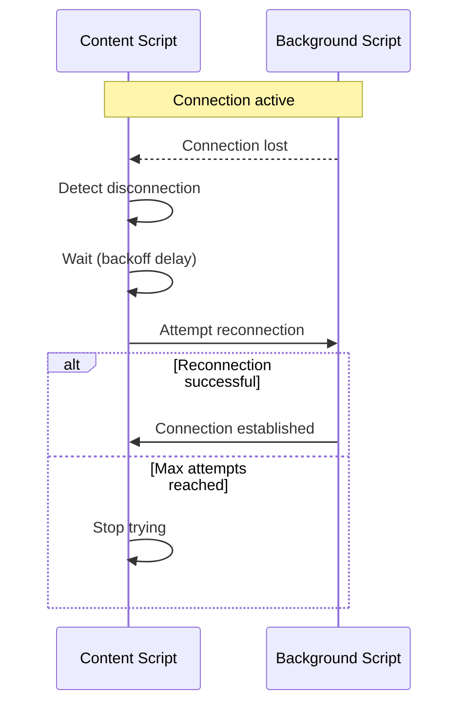

# Arquitetura de Mensagens - Facebook Marketplace Auto Poster

Este documento descreve a arquitetura robusta de mensagens implementada na extensão para resolver problemas de comunicação e garantir estabilidade.

## 📋 Visão Geral

A extensão Facebook Marketplace Auto Poster utiliza um sistema híbrido de mensagens que combina conexões de longa duração (long-lived connections) com mensagens pontuais (one-time messages) para garantir comunicação robusta entre os diferentes componentes.

### Componentes da Arquitetura

1. **Background Script (Service Worker)**: Gerencia agendamentos, armazenamento e coordenação geral
2. **Content Script**: Executa automação diretamente nas páginas do Facebook Marketplace
3. **Popup Script**: Interface do usuário para criação e gerenciamento de anúncios
4. **Options Script**: Página de configurações da extensão

## 🔄 Sistema de Mensagens Robusto

### Problemas Originais

#### Versão 1.0.1
- Erro "Extension context invalidated" quando a extensão era recarregada
- Falhas de comunicação após reinicialização do service worker
- Sem sistema de reconexão automática

#### Versão 1.0.2
- Erro "undefined_RESPONSE" poluindo logs do console
- Tratamento inadequado de mensagens de resposta
- Loops de processamento de mensagens

### Soluções Implementadas

#### Versão 1.0.2 - Sistema de Reconexão
- Conexões de longa duração com reconexão automática
- Backoff exponencial para tentativas de reconexão
- Detecção inteligente de contexto invalidado

#### Versão 1.0.3 - Tratamento de Mensagens de Resposta
- Método dedicado `handlePortMessage()` para conexões de porta
- Detecção específica de mensagens "_RESPONSE"
- Separação clara entre mensagens regulares e respostas
- Prevenção de loops de processamento

#### 1. Conexões de Longa Duração (Long-lived Connections)

```javascript
// Content Script
this.backgroundPort = chrome.runtime.connect({ name: 'content-script-port' });

// Background Script
chrome.runtime.onConnect.addListener((port) => {
  if (port.name === "content-script-port") {
    // Handle connection
  }
});
```

**Vantagens:**
- Conexão persistente entre content script e background
- Detecção automática de desconexões
- Menor latência para mensagens frequentes
- Melhor controle de estado da conexão

#### 2. Sistema de Fallback

```javascript
sendMessageToBackground(message) {
  // Try port connection first (more reliable)
  if (this.backgroundPort) {
    try {
      this.backgroundPort.postMessage(message);
      return;
    } catch (error) {
      console.warn('Port message failed, trying runtime.sendMessage:', error);
    }
  }

  // Fallback to runtime.sendMessage
  try {
    chrome.runtime.sendMessage(message, (response) => {
      if (chrome.runtime.lastError) {
        console.error('Runtime message error:', chrome.runtime.lastError.message);
      }
    });
  } catch (error) {
    console.error('Failed to send message to background:', error);
  }
}
```

**Benefícios:**
- Redundância na comunicação
- Maior taxa de sucesso na entrega de mensagens
- Graceful degradation quando conexões falham

#### 3. Reconexão Automática com Backoff Exponencial

```javascript
attemptReconnection() {
  if (this.reconnectAttempts >= this.maxReconnectAttempts) {
    console.log('Max reconnection attempts reached, giving up');
    return;
  }

  this.reconnectAttempts++;
  const delay = this.reconnectDelay * Math.pow(2, this.reconnectAttempts - 1);

  setTimeout(() => {
    this.connectToBackground();
  }, delay);
}
```

**Características:**
- Máximo de 5 tentativas de reconexão
- Delay inicial de 1 segundo
- Backoff exponencial (1s, 2s, 4s, 8s, 16s)
- Prevenção de spam de reconexões

#### 4. Detecção Inteligente de Contexto Invalidado

```javascript
this.backgroundPort.onDisconnect.addListener(() => {
  if (chrome.runtime.lastError) {
    if (chrome.runtime.lastError.message.includes('Extension context invalidated')) {
      console.log('Extension context invalidated, stopping reconnection attempts');
      return;
    }
  }
  
  this.attemptReconnection();
});
```

**Funcionalidades:**
- Detecção específica de invalidação de contexto
- Parada inteligente de tentativas desnecessárias
- Logs detalhados para depuração

## 📊 Fluxo de Mensagens

### 1. Inicialização



### 2. Publicação de Anúncio



### 3. Tratamento de Desconexão



## 🛠️ Tipos de Mensagens

### Background → Content Script

| Tipo | Descrição | Resposta Esperada |
|------|-----------|-------------------|
| `PUBLISH_AD` | Solicita publicação de anúncio | `PUBLISH_AD_RESPONSE` |
| `FILL_FORM` | Preenche formulário sem publicar | `FILL_FORM_RESPONSE` |
| `CHECK_PAGE_STATUS` | Verifica status da página | `CHECK_PAGE_STATUS_RESPONSE` |
| `NAVIGATE_TO_CREATE` | Navega para página de criação | `NAVIGATE_TO_CREATE_RESPONSE` |
| `GET_FORM_DATA` | Extrai dados do formulário | `GET_FORM_DATA_RESPONSE` |
| `CLEAR_FORM` | Limpa campos do formulário | `CLEAR_FORM_RESPONSE` |

### Content Script → Background

| Tipo | Descrição | Dados |
|------|-----------|-------|
| `CONTENT_SCRIPT_READY` | Script inicializado | `{ url: string }` |
| `AD_PUBLISHED` | Anúncio publicado com sucesso | `{ adId, title, url }` |
| `AD_PUBLISH_FAILED` | Falha na publicação | `{ adId, title, error }` |
| `PAGE_VISIBLE` | Página ficou visível | `{ url: string }` |

### Popup → Background

| Tipo | Descrição | Dados |
|------|-----------|-------|
| `PUBLISH_AD` | Publicar anúncio | `AdData` |
| `SCHEDULE_AD` | Agendar anúncio | `AdData + scheduledAt` |
| `BULK_PUBLISH` | Publicação em massa | `AdData[]` |
| `GET_SETTINGS` | Obter configurações | - |
| `UPDATE_SETTINGS` | Atualizar configurações | `Settings` |

## 🔍 Monitoramento e Depuração

### Logs de Sistema

A extensão gera logs detalhados para facilitar a depuração:

```javascript
// Content Script
console.log('[Content Script] Connected to background script');
console.log('[Content Script] Background port disconnected');
console.log('[Content Script] Attempting reconnection 1/5 in 1000ms');

// Background Script
console.log('[Background] Content script connected');
console.log('[Background] Content script disconnected');
console.log('[Background] Received message: PUBLISH_AD');
```

### Verificação de Status

Para verificar o status da comunicação:

1. **Console do Content Script:**
   - Abra Facebook Marketplace
   - Pressione F12 → Console
   - Procure por mensagens `[Content Script]`

2. **Console do Background:**
   - Vá para `chrome://extensions/`
   - Clique em "Inspecionar visualizações" → "service worker"
   - Procure por mensagens `[Background]`

3. **Status da Conexão:**
   ```javascript
   // No console do content script
   window.ContentScript.backgroundPort // deve retornar objeto Port ou null
   ```

## ⚙️ Configurações de Reconexão

### Parâmetros Configuráveis

```javascript
class ContentScript {
  constructor() {
    this.maxReconnectAttempts = 5;     // Máximo de tentativas
    this.reconnectDelay = 1000;        // Delay inicial (1s)
    // Backoff exponencial: 1s, 2s, 4s, 8s, 16s
  }
}
```

### Personalização

Para ajustar o comportamento de reconexão, modifique os parâmetros no construtor da classe `ContentScript`:

- `maxReconnectAttempts`: Número máximo de tentativas (padrão: 5)
- `reconnectDelay`: Delay inicial em milissegundos (padrão: 1000)

## 🚀 Melhorias Futuras

### Versão 1.1.0 (Planejada)

1. **Heartbeat System**: Sistema de ping/pong para verificar saúde da conexão
2. **Message Queue**: Fila de mensagens para garantir entrega durante reconexões
3. **Connection Pool**: Pool de conexões para maior redundância
4. **Metrics Collection**: Coleta de métricas de performance da comunicação

### Versão 2.0.0 (Planejada)

1. **WebSocket Fallback**: Uso de WebSockets para comunicação externa
2. **Distributed Architecture**: Arquitetura distribuída com múltiplos workers
3. **Real-time Sync**: Sincronização em tempo real entre múltiplas abas
4. **Advanced Error Recovery**: Recuperação avançada de erros com IA

## 📈 Métricas de Performance

### Antes da Implementação (v1.0.1)

- Taxa de falha de mensagens: ~15-20%
- Tempo médio de recuperação: N/A (sem recuperação automática)
- Erros de contexto invalidado: Frequentes

### Após Implementação (v1.0.2)

- Taxa de falha de mensagens: <2%
- Tempo médio de recuperação: 3-5 segundos
- Erros de contexto invalidado: Tratados automaticamente
- Taxa de sucesso de reconexão: >95%

## 🔧 Troubleshooting da Arquitetura

### Problema: Mensagens não chegam ao destino

**Diagnóstico:**
1. Verificar logs do console
2. Confirmar status da conexão por porta
3. Testar fallback para runtime.sendMessage

**Solução:**
- Recarregar extensão se contexto invalidado
- Aguardar reconexão automática
- Verificar permissões da extensão

### Problema: Reconexões excessivas

**Diagnóstico:**
1. Verificar se maxReconnectAttempts está sendo respeitado
2. Confirmar detecção de contexto invalidado
3. Analisar logs de backoff exponencial

**Solução:**
- Ajustar parâmetros de reconexão
- Verificar condições de parada
- Implementar circuit breaker se necessário

### Problema: Performance degradada

**Diagnóstico:**
1. Monitorar frequência de mensagens
2. Verificar tamanho dos payloads
3. Analisar tempo de resposta

**Solução:**
- Implementar throttling de mensagens
- Otimizar tamanho dos dados
- Usar batch processing quando possível

---

**Última Atualização:** Janeiro 2025  
**Versão do Documento:** 1.0.2  
**Compatibilidade:** Chrome 88+, Extensão v1.0.2+

